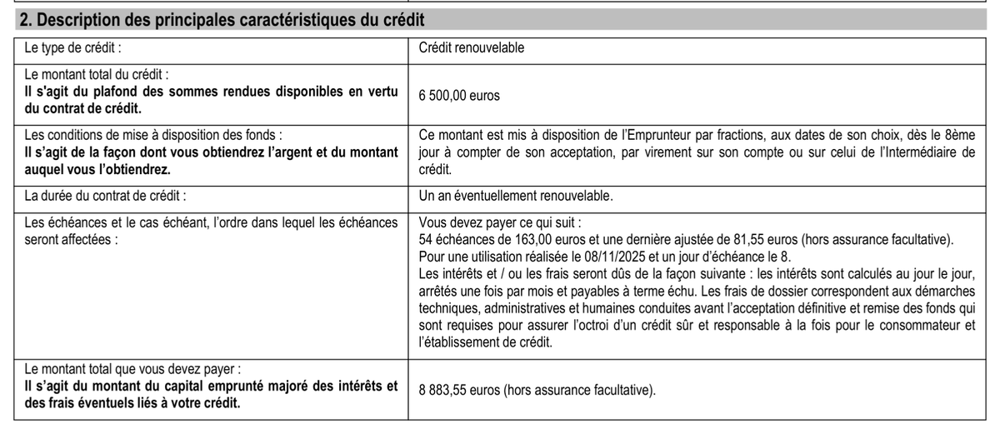
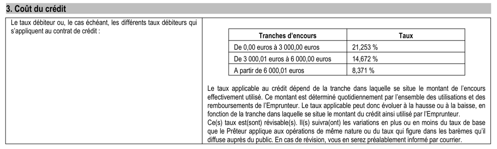
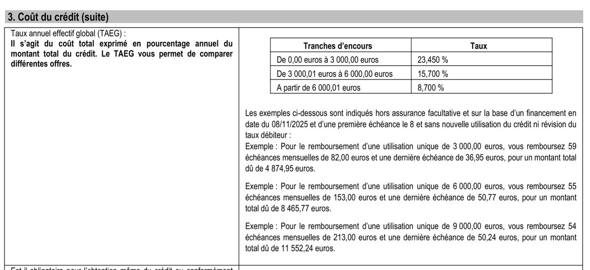
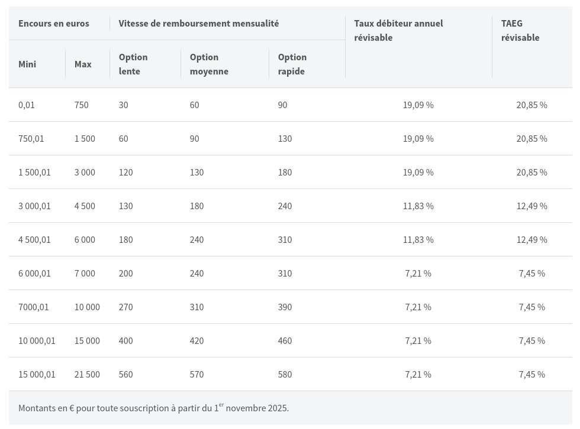
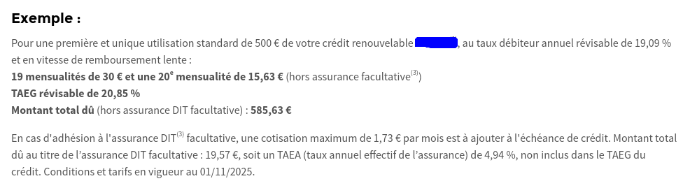
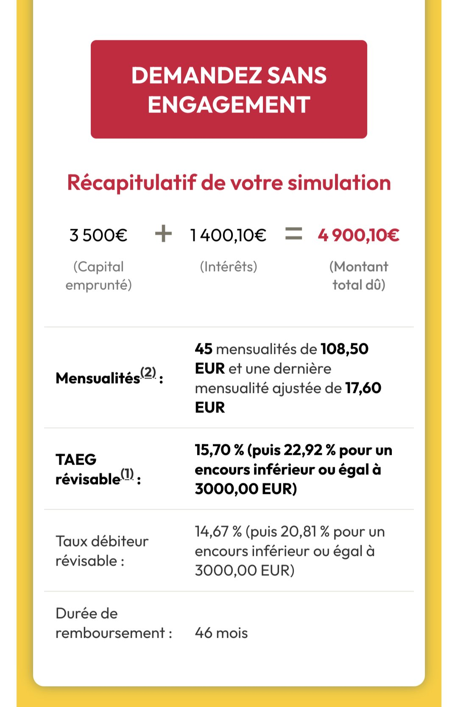

# Quelques exemples d'offres

Nous avons récolté quelques offres non conformes. Elles sont présentées ici
de manière anonymisées.

## Offre n°1

Cet établissement de crédit connu propose un crédit renouvelable « par
palier » de 6500€ à rembourser en 54 échéances de 163€ et une dernière de
81,55€, pour un montant total de 8883,55€ Le TAEG n'est pas communiqué,
seuls sont communiqués les taux débiteurs par paliers et leur annualisation
en guise de TAEG. Cette offre n'est pas conforme à la réglementation sur les
éléments obligatoirements communiqués à l'emprunteur, et est de plus
usuraire. Le TAEG de l'échelonnement proposé est à 15,33%.

Cette offre ne devrait plus être commercialisée selon nous.

## Offre n°2

Cet établissement de crédit connu propose un tableau de mensualités et de
taux débiteurs. Sans information supplémentaire il est difficile de juger du
caractère usuraire ou non de l'offre. L'exemple donné n'est pas suffisant au
regard de la réglementation qui requiert des exemples de 500€, 1500€ et
3000€ dans les documentations commerciales selon l'article [D.312-21 du code de la consommation](https://www.legifrance.gouv.fr/codes/article_lc/LEGIARTI000032807460).

En laissant les mensualités et les taux varier selon l'encours comme le
laisse supposer les intitulés du tableau, un capital emprunté de 6500€ en
option « lente » s'amortit en 97 mensualités (variables), pour un coût total
8958,28€ et le TAEG ressort à 13.81%.

Une demande de précisions par l'ACPR auprès de cet établissement de crédit
serait justifiée.

## Offre n°3

Cet établissement de crédit connu propose un crédit renouvelable de 3500€
remboursable en 45 mensualités de 108,50€ et une dernière de 17,60€, pour un
coût total de 4900,10€. La présentation du TAEG n'est pas conforme.

Le TAEG de l'amortissement proposé ressort à 20,37%.

Cette offre ne devrait plus être commercialisée selon nous.

